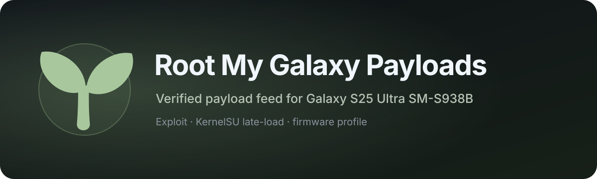

  

  
  
  
  
  
  
  

  <strong>Payload and firmware-profile repository used by Root My Galaxy.</strong>

This repository contains the files that [Root My Galaxy](https://github.com/igorcv88/Root-My-Galaxy-S938B) uses to obtain temporary root and late-load KernelSU on the supported Galaxy S25 Ultra firmware.

> [!IMPORTANT]
> If you only want to root the phone, download the app from [Root My Galaxy Releases](https://github.com/igorcv88/Root-My-Galaxy-S938B/releases/latest). Normal users do not need to download or run files from this repository manually.

## Supported device

The active v3 payload feed currently supports this exact configuration:

| | Supported configuration |
| --- | --- |
| Device | Samsung Galaxy S25 Ultra `SM-S938B` (`pa3q`) |
| Firmware | `S938BXXSBCZG3` |
| Android | Android 16 / API 36 |
| Kernel | `6.6.98-android15-8-pd6ff1cd-abogkiS938BXXSBCZG3-4k` |
| ABI | `arm64-v8a` |
| Page size | 4K |

The app compares the phone against the maintained profile before using the payload automatically. A firmware or kernel update can make the current payload incompatible.

## What this repository provides

Root My Galaxy uses three pieces from this repository:

- **Support profile** — tells the app which exact device, firmware and kernel a payload belongs to.
- **Exploit payload** — performs the supported kernel exploit and acquires temporary bootstrap root.
- **KernelSU payload** — late-loads the matching KernelSU module after bootstrap root is available.

The active app feed is stored in `support/targets-v3.json`. Each executable entry includes its expected file size and SHA-256 checksum.

## How the app uses the payloads

During a normal manual installation, Root My Galaxy resolves the current payload repository commit, loads the v3 support profile, downloads the files from that immutable commit, and verifies their expected size and SHA-256 before execution.

For **Auto Root**, the matching profile is embedded into each Root My Galaxy APK. The APK release process synchronizes that embedded profile with the current v3 payload feed before building, while the actual boot-time Auto Root run uses the already cached and verified local payloads.

## Root lifetime

The payload late-loads KernelSU for the current kernel boot. It does not flash a boot image or make the Samsung kernel modification permanent. A full reboot returns the device to the normal stock boot state; Root My Galaxy can then restore KernelSU through its optional Auto Root feature.

## Integrity and compatibility

The maintained v3 profile includes exact device identity plus checksums for the exploit and KernelSU payload. If the profile does not match the device or a downloaded file does not match its declared metadata, Root My Galaxy stops instead of treating the file as valid.

The older v2 profile remains present for compatibility with previously released app versions. Current Root My Galaxy releases use the v3 feed.

## Related project

Use [Root My Galaxy](https://github.com/igorcv88/Root-My-Galaxy-S938B) for installation, Auto Root, Shizuku support, update checks, run history and log export.

## License and credits

This repository is distributed under the license in [LICENSE](LICENSE). The exploit work is derived from Root My Galaxy, and the late-load root payload uses [KernelSU](https://github.com/tiann/KernelSU).
